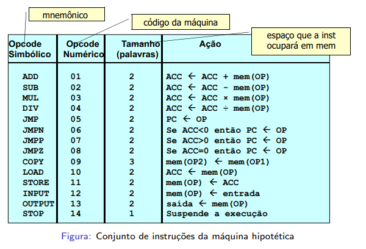

# SoftwareBasico-2021.2

Este repositorio terá os trabalhos da materia Software Básico no semestre 2021.2

## Trabalho 1
Montador de arquivos em assembly imaginario para linguagem de maquina, criando um arquivo .obj caso não haja erros, e Compilador para executar as instruções do arquivo objeto criado pelo montador.

O assembly imaginario é representado pela seguinte imagem: 

